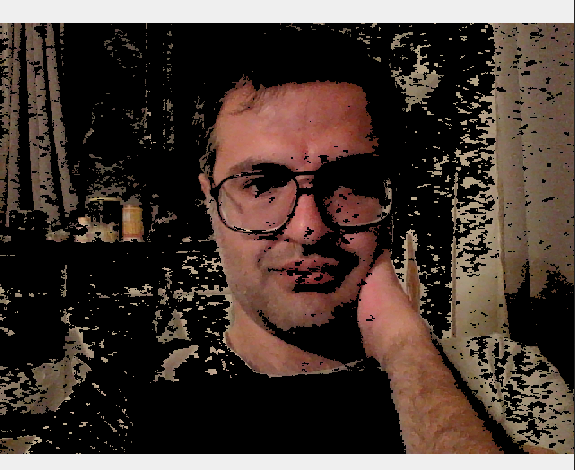
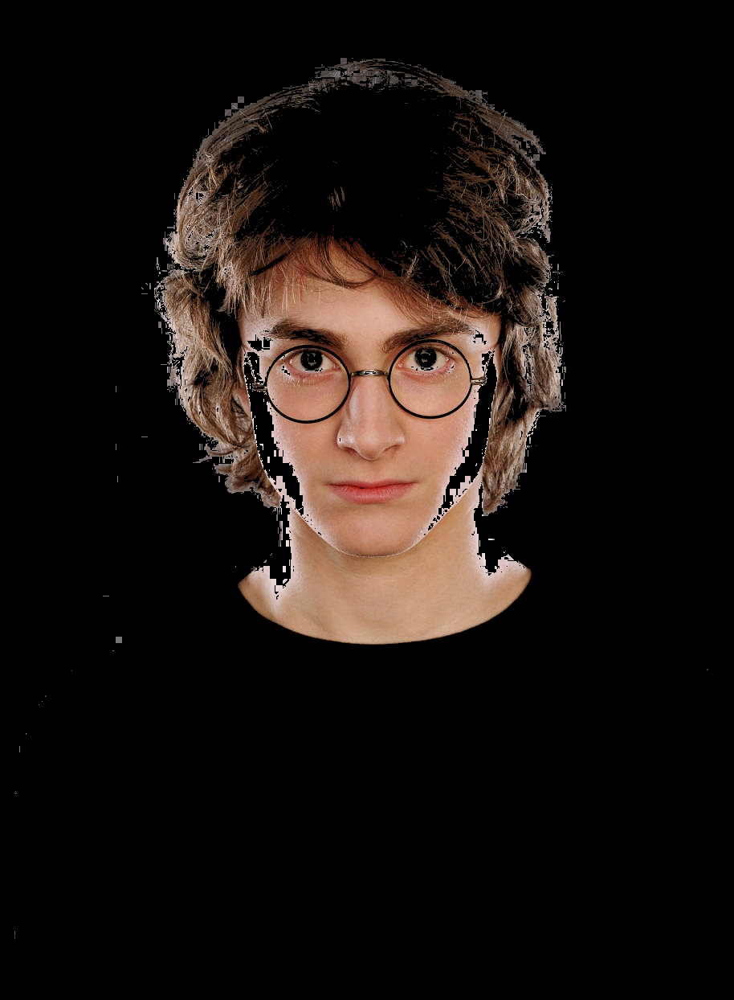

# image_processing_Assignment_30

## First Assignment
In the first assignment, Superman flying in the sky using blue screen technique.

#### Input:

#### Output:

## Second Assignment
skin Detection by with photo and webcam

#### Output --WebCam--:

#### Input --image--:

#### Output:

